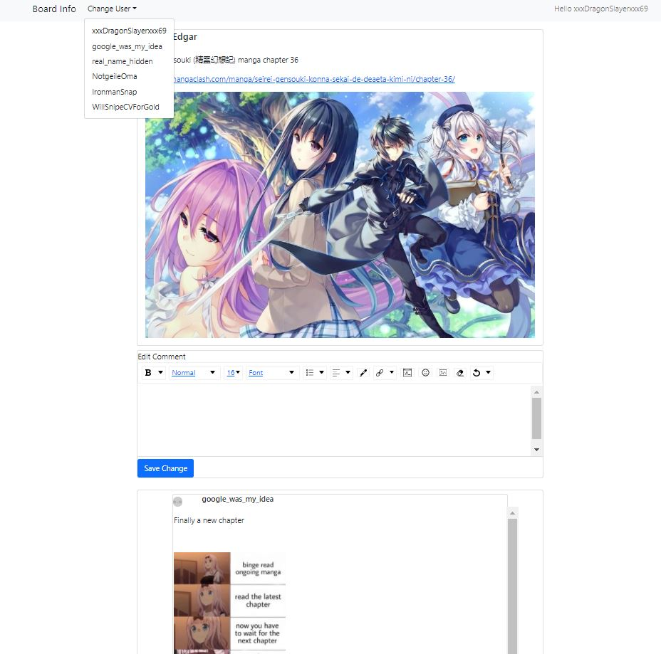

## Run Test Exercise 2
### Download and Install nodejs
- download and install node js from [here](https://nodejs.org/en/download/)

### Install Visual studio
- Install visual studio: [https://docs.microsoft.com/en-us/visualstudio/install/install-visual-studio?view=vs-2019](https://docs.microsoft.com/en-us/visualstudio/install/install-visual-studio?view=vs-2019)
- When installing, remember to chose **.NET cross-platform development** when promted to chose Workload for ASP.NET Core

### Run test backend (repo "9-code-exercises-Ex9-backend")
- Copy comment.db in "SampleDatabase" to this folder **C:\Users\{current user}\AppData\Local**
- Open backend project (open .sln file with visualstudio) in visualstudio (github repo **9-code-exercises-Ex9-backend**)
- launch dev mode (press play icon on toolbar or F5)
- make sure server is running by accessing this link in a browser ***http://localhost:5001/images/Seirei-Gensouki.jpg***

### Run test frontent (repo "9-code-exercises")
#### Install dependencies
- run ```npm install```
#### Run Exercise
- run ```npm start```
- access dev server at [http://localhost:3000](http://localhost:3000)

### Using the program 

- you can use change user to simulate login as different user, see which user you are by looking at the top right (hello, **[username]**)
- Use the comment editor to create comment, upload image by pressing image option on the comment editor toolbar (picture icon)
- save change to create comment

